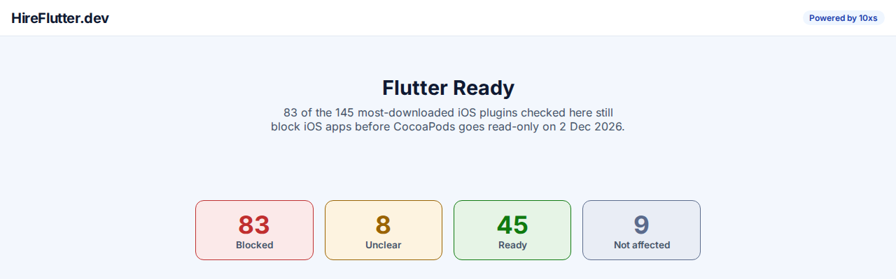
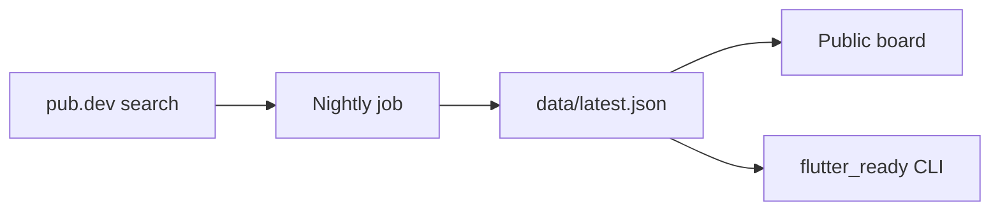

<div align="center">

# Flutter Ready

**Which of your Flutter plugins will block your next release?**

[](https://github.com/Integrity-Ventures/flutter-ready/actions/workflows/ci.yml)
[](LICENSE)
[](https://ready.hireflutter.dev)
[](https://pub.dev/packages/flutter_ready)

</div>

<p align="center">
  
</p>

## Why this exists

Two platform deadlines are about to break Flutter releases that depend on
plugins nobody's checked yet:

- **CocoaPods goes read-only on 2 December 2026.** Every plugin that hasn't
  added Swift Package Manager (SPM) support becomes a blocker for new iOS
  builds.
- **Google Play requires API 36, and native `.so` libraries must be
  16 KB-page-aligned.** A plugin that ships an unaligned native library
  blocks your next Play release.

Today you find out which of your plugins is the problem one app at a time,
usually the day a release fails. Flutter Ready checks the most-downloaded
plugins on pub.dev against both deadlines, every night, and gives you a
board and a CLI to find out before that day comes.

## Features

- **A public board** at [ready.hireflutter.dev](https://ready.hireflutter.dev): every checked plugin, its own page, reds sorted to the top by downloads.
- **A CLI** (`flutter_ready check`) that reads your app's `pubspec.lock` and reports which of your plugins will block your next release, with evidence and a suggested replacement where one is known.
- **A GitHub Action** that runs the same check in CI and fails the job on a blocker.
- **A nightly data refresh**: the data behind the board and the CLI is rebuilt from pub.dev every night; the CLI downloads the latest copy each run.

## Quick start

```sh
dart pub global activate flutter_ready
flutter_ready check
```

Run it from your app's root, next to `pubspec.lock`. It exits with code `1`
if anything blocks. Real output, run against
[`fixtures/sample_app`](fixtures/sample_app) (a synthetic app pinned to a
plugin that's always graded red, kept for exactly this kind of demo):

```
$ flutter_ready check --data fixtures/sample_app/data/latest.json --lockfile fixtures/sample_app/pubspec.lock --offline
Flutter Ready check — 1 hosted package(s) in pubspec.lock.

CocoaPods registry goes read-only (2026-12-02):
  BLOCKER: fixture_blocked_plugin 1.0.0: No Package.swift in the fixture_blocked_plugin archive. — from Flutter Ready data (2026-09-27)
    Suggested replacement: fixture_green_plugin — fixture-only suggestion, for golden tests
```

Options:

- `--lockfile <path>`: path to `pubspec.lock`, if not in the current directory.
- `--data <path|url>`: an alternate readiness data source, instead of the published `latest.json`.
- `--offline`: never check an unlisted plugin live against pub.dev; report it as "not checked" instead.

## GitHub Action

```yaml
- uses: Integrity-Ventures/flutter-ready@main
  with:
    lockfile: pubspec.lock # optional, defaults to pubspec.lock
```

This compiles and runs `flutter_ready check` against the given lockfile and
fails the job on a blocker.

## What the statuses mean

| Status | Meaning |
|---|---|
| **Blocked** | Fails a deadline check today — for example, no Swift Package Manager support before CocoaPods goes read-only. |
| **Unclear** | Signals disagree (for example, pub.dev's SwiftPM tag and the package archive don't agree) — check the plugin's page for the evidence. |
| **Ready** | Passes the check: ships the platform support the deadline requires. |
| **Not affected** | The deadline doesn't apply — for example, a plugin with no native iOS code can't be blocked by the CocoaPods deadline. |
| **Not checked** | Couldn't be verified (for example, a plugin not yet in the nightly data, or a live check that failed) — never shown as green. |

## How it works



Every night, `snapshot_job` searches pub.dev for the most-downloaded Flutter
plugins, downloads each one's package archive, and checks it against both
deadlines (SwiftPM readiness, 16 KB native library alignment, plus Android
build facts). The result is committed to `data/latest.json`, which both the
board and the CLI read — so a visitor on the website and a developer running
the CLI always see the same verdict.

## Repo layout

```
packages/
  flutter_ready/   CLI + the shared readiness-check library, published on pub.dev
  snapshot_job/    nightly job that rebuilds data/latest.json from pub.dev
site/              the public board (a static Jaspr site)
data/              latest.json, dated snapshots, deadlines.json, replacements.json
fixtures/          sample app and fixture data used in tests and docs
```

## Contributing

Each package under `packages/` and `site/` is a Dart package:

```sh
dart pub get
dart analyze --fatal-infos
dart test
```

Issues and pull requests are welcome.

## Built with AI, managed by 10xs

This repository is written by AI coding agents managed through
[10xs](https://10xs.ai). A human owner sets the direction, approves the plan
and accepts every card on the 10xs board; agents write the code, tests and
evidence in their own sessions and push through the board's gates. Commits
carry `Co-Authored-By: 10xs.ai`. The first commits, made before 10xs was
connected, carry the agent's own attribution and are kept as they were.

See [`BRIEF.md`](BRIEF.md) for what was asked for, [`SPEC.md`](SPEC.md) for
the v1 direction, and [`STATUS.md`](STATUS.md) for what's built and what's
still held for the owner.

## Credits and licence

Built by Integrity Ventures Private Limited ([ivp.life](https://ivp.life)) ·
hosted by HireFlutter ([hireflutter.dev](https://hireflutter.dev)) · MIT
licensed, see [`LICENSE`](LICENSE).
